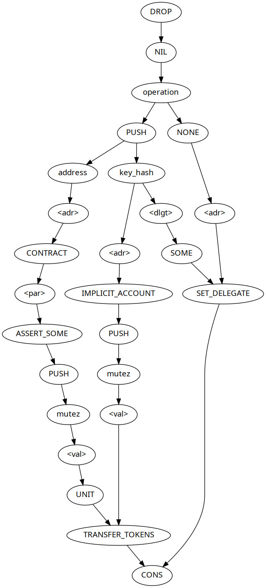

# APDU

An APDU is sent by a client to the ledger hardware. This message tells
the ledger some operation to run. Most APDU messages will be
accompanied by an Accept / Deny prompt on the Ledger. Once the user
hits “Accept” the Ledger will issue a response to the Tezos client.
The basic format of the APDU request follows.

| Field | Length | Description                                                             |
|-------|--------|-------------------------------------------------------------------------|
| CLA   | 1 byte | Instruction class (always 0x80)                                         |
| INS   | 1 byte | Instruction code (0x00-0x0f)                                            |
| P1    | 1 byte | User-defined 1-byte parameter                                           |
| P2    | 1 byte | Derivation type (0=ED25519, 1=SECP256K1, 2=SECP256R1, 3=BIPS32_ED25519) |
| LC    | 1 byte | Length of CDATA                                                         |
| CDATA | <LC>   | Payload containing instruction arguments                                |

Each APDU has a header of 5 bytes followed by some data. The format of
the data will depend on which instruction is being used.

## Example

Here is an example of an APDU message from the ledger-app-tezos tests:

> 0x8001000011048000002c800006c18000000080000000

This parses as:

| Field | Value                                |
|-------|--------------------------------------|
| CLA   | 0x80                                 |
| INS   | 0x01                                 |
| P1    | 0x00                                 |
| P2    | 0x00                                 |
| LC    | 0x11 (17)                            |
| CDATA | 0x048000002c800006c18000000080000000 |

0x01 is the first instruction and is used for "authorize baking". This
APDU asks the ledger to use its internal private keys to sign an
authorization to bake. Note that this instruction is only recognized
by the baking app, and not the wallet app.

A list of more instructions follows.

## APDU instructions in use by Tezos Ledger apps

| Instruction                     | Code | App | Prompt | Short description                                |
|---------------------------------|------|-----|--------|--------------------------------------------------|
| `INS_VERSION`                   | 0x00 | WB  | No     | Get version information for the ledger           |
| `INS_AUTHORIZE_BAKING`          | 0x01 | B   | Yes    | Authorize baking                                 |
| `INS_GET_PUBLIC_KEY`            | 0x02 | WB  | No     | Get the ledger’s internal public key             |
| `INS_PROMPT_PUBLIC_KEY`         | 0x03 | WB  | Yes    | Prompt for the ledger’s internal public key      |
| `INS_SIGN`                      | 0x04 | WB  | Yes    | Sign a message with the ledger’s key             |
| `INS_SIGN_UNSAFE`               | 0x05 | W   | Yes    | Sign a message with the ledger’s key (no hash)   |
| `INS_RESET`                     | 0x06 | B   | Yes    | Reset high water mark block level                |
| `INS_QUERY_AUTH_KEY`            | 0x07 | B   | No     | Get auth key                                     |
| `INS_QUERY_MAIN_HWM`            | 0x08 | B   | No     | Get current high water mark                      |
| `INS_GIT`                       | 0x09 | WB  | No     | Get the commit hash                              |
| `INS_SETUP`                     | 0x0a | B   | Yes    | Setup a baking address                           |
| `INS_QUERY_ALL_HWM`             | 0x0b | B   | No     | Get all high water mark information              |
| `INS_DEAUTHORIZE`               | 0x0c | B   | No     | Deauthorize baking                               |
| `INS_QUERY_AUTH_KEY_WITH_CURVE` | 0x0d | B   | No     | Get auth key and curve                           |
| `INS_HMAC`                      | 0x0e | B   | No     | Get the HMAC of a message                        |
| `INS_SIGN_WITH_HASH`            | 0x0f | WB  | Yes    | Sign a message with the ledger’s key (with hash) |

- B = Baking app, W = Wallet app

## Signing operations

There are 3 APDUs that deal with signing things. They use the Ledger’s
private key to sign messages sent. They are:

| Instruction          | Code | App | Parsing | Send hash |
|----------------------|------|-----|---------|-----------|
| `INS_SIGN`           | 0x04 | WB  | Yes     | No        |
| `INS_SIGN_UNSAFE`    | 0x05 | W   | No      | No        |
| `INS_SIGN_WITH_HASH` | 0x0f | WB  | Yes     | Yes       |

The main difference between `INS_SIGN` and `INS_SIGN_UNSAFE` is that
`INS_SIGN_UNSAFE` skips the parsing step which shows what operation is
included in the APDU data. This is unsafe, because the user doesn’t
see what operation they are actually signing. When this happens, we
tell the user “Unrecognized: Sign Hash” so that they can make
appropriate external steps to verify this hash.

### Parsing operations

Each Tezos block that is received through `INS_SIGN` is parsed and the
results are shown on the Ledger’s display. At many points, this
parsing may fail, and the Tezos app will fall back in this case to
“Unrecognized: Sign Hash” mode.

Parsing some Tezos blocks are particularly difficult. Contract
“originations” contain Michelson data that could be too big to display
and transactions can contain “parameters” which can be any valid
Michelson data. Currently, only a small subset of parameters are
parsed, and no contract originations can be parsed.

There is not enough resources on the Ledger Nano S to parse any
arbitrary operation, but we can match to a predefined template.
Currently, the Tezos app matches to templates provided for specific
Manager.tz operations, which are part of the migration to Babylon. In
the Babylon migration, implicit contracts are converted to originated
contracts. We support Babylon to make sure those contracts are still
accessible via Ledger signing. More details on the migration are
available at
[migration_004_to_005.md](https://gitlab.com/cryptiumlabs/tezos/blob/master/specs/migration_004_to_005.md).

There are four Michelson operations currently supported in the Ledger.
They are:

- set delegate
- remove delegate
- transfer implicit to contract
- transfer contract to contract

Each of these comes with its own Michelson sequence, each beginning
with `DROP ; NIL operation` and ending with `CONS`. From there, we
match like this:

#### Manager.tz parsing limitations

There are some limitations for Michelson parsing that should be noted.

- Arguments passed to Manager.tz contract must match exactly those
  described in the migration document. Any variations will be
  rejected.
- All endpoints other than “do” are rejected.
- Amount transferred must be 0.
- “contract-to-contract” requires that you use:
  - the default endpoint for your destination contract
  - the parameters must be of type unit

